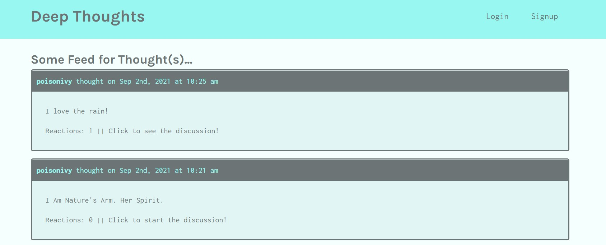

# Deep Thoughts

## License

## Description
A social media application built with the MERN stack (MongoDB, Express.js, React, and Node.js). With this application, users are able to sign up and create an account, post their thoughts, and interact with other users.

Deployed application on heroku: https://deep-thoughts826103.herokuapp.com/

## Screenshots

## Table of Contents
 * [Installation](#installation)
 * [Usage](#usage)
 * [Contributing](#contributing)
 * [Questions](#questions)
        
## Installation
Clone this repository and enter `npm install` in the terminal to install the necessary dependencies.
   
## Usage
Enter `npm run develop` to start the development server on `http://localhost:3000/` and use GraphQL at `http://localhost:3001/graphql`.

## Contributing
Charity Rogers

## Questions
If you have any questions, please contact me!

  - GitHub: https://github.com/rogerscl116
  - Email: rogerscl116@gmail.com
  
